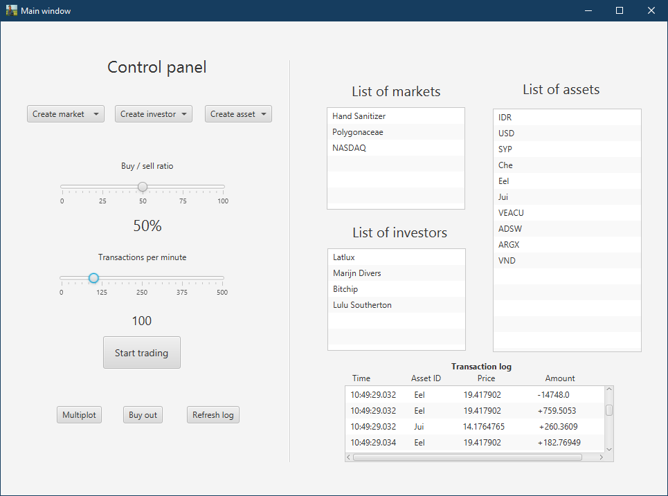
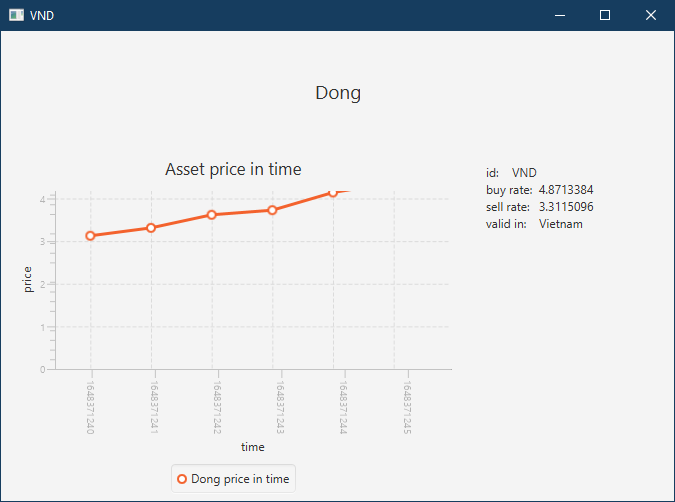
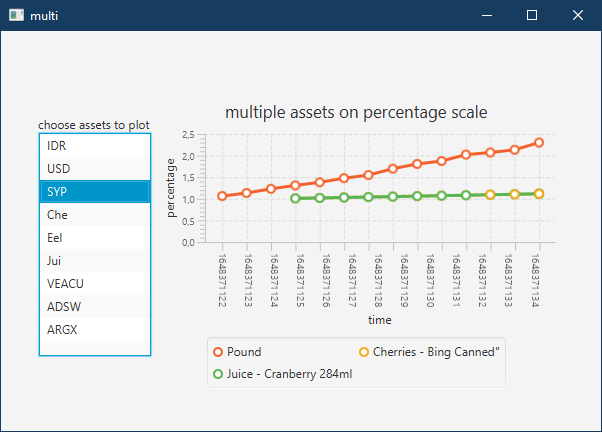
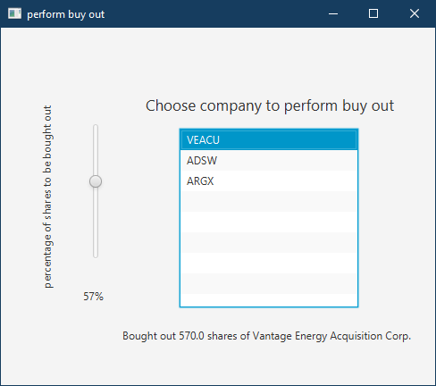

# market-simulator
## Description
A project created to simulate trading on various markets. Through GUI, user can control number of transactions per minute,
manage entities and visualize price fluctuations.

## Details
The main entities in this project are markets, indexes, companies, investors, funds, currencies, and commodities.
Each investor and asset is separate thread to allow concurrent transactions. The code is object-oriented
and introduces some design patterns. Data was randomly generated and is included in csv files.

## Interface
GUI was created with javaFX and allows user to control the simulation.
### Main panel

### Asset info

### Plots

### Buyout operation
